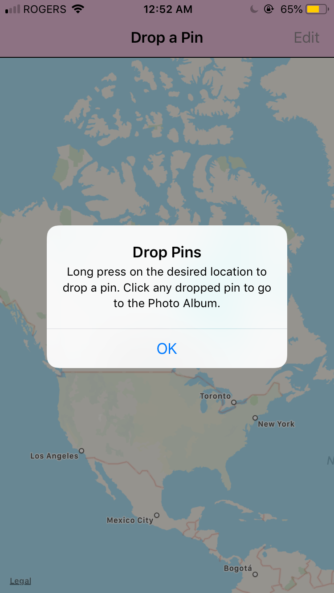
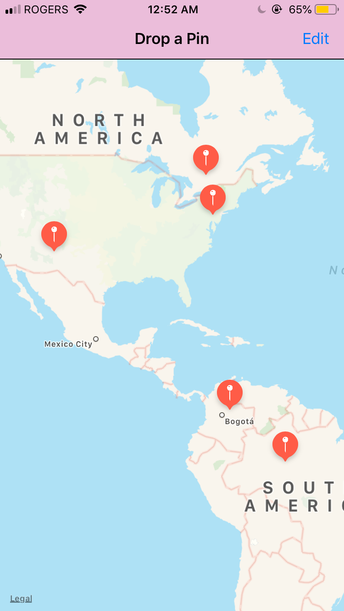
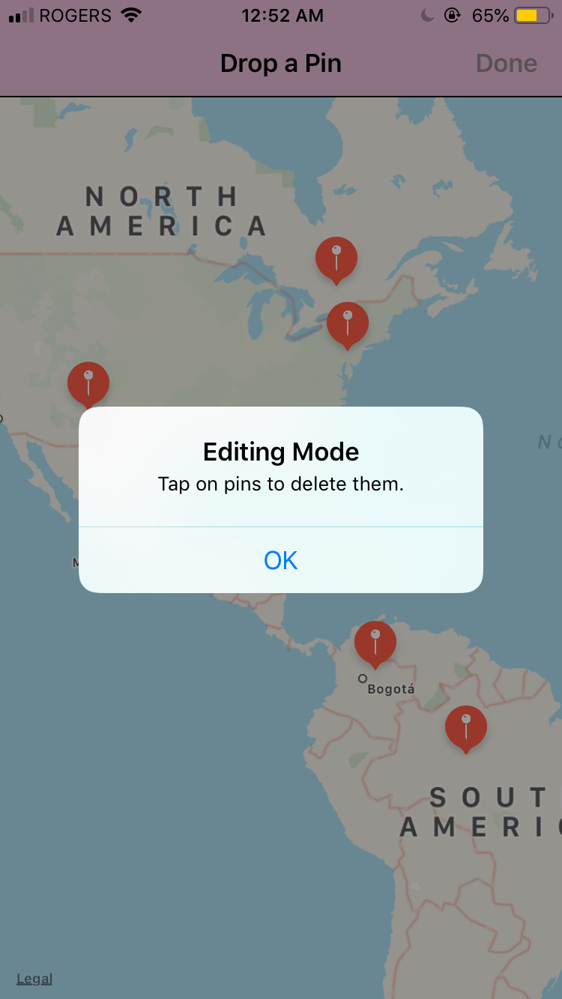
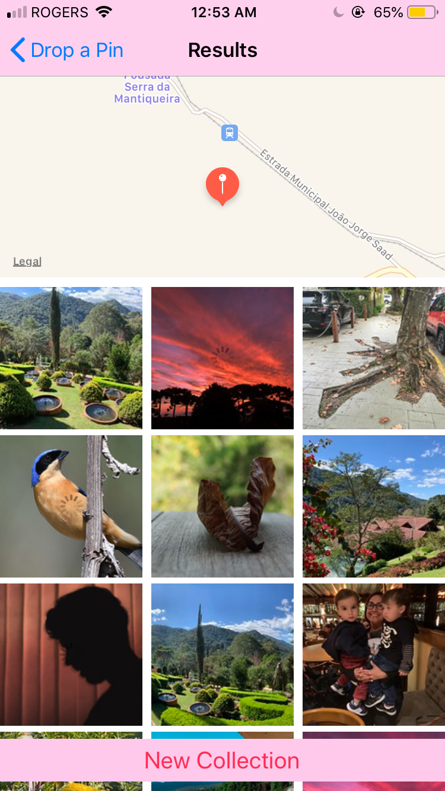

# VirtualTourist_Udacity
This app downloads and stores images from Flickr. The app will allow users to drop pins on a map, as if they were stops on a tour. Users will then be able to download pictures for the location and persist both the pictures, and the association of the pictures with the pin.
   
# VirtualTourist_Udacity Snapshots & Demo
  

• Upon launching the app: User Instructions

• Dropping the pins

• Editing mode

• Fetched Images

